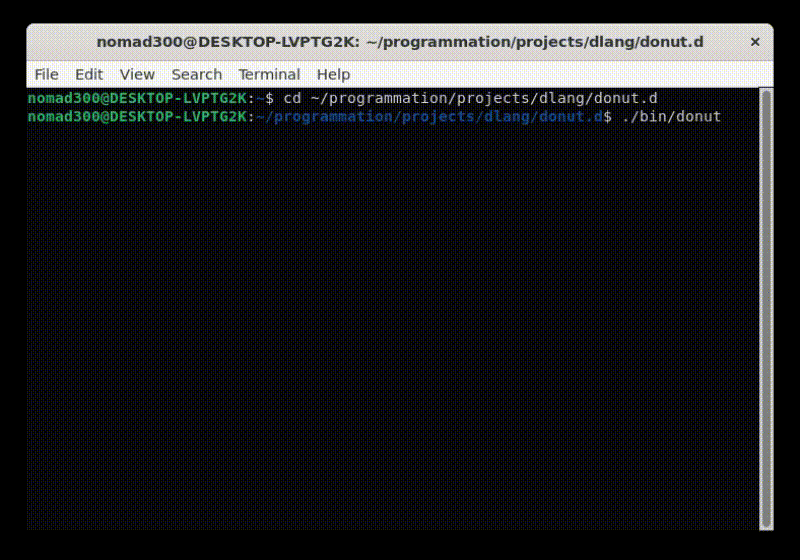

# donut.d

`donut.c` remade in the [D programming language](https://dlang.org/)

## Files :

- `donut.d` : The final version, use an automatic detection of the OS, can be run on Windows and Unix systems.
- `donut.unix.d` : The Unix version
- `donut.win.d` : The Windows version

## Demo :

`donut.d` executed on Linux on WSL2 (Windows Subsystem for Linux)
